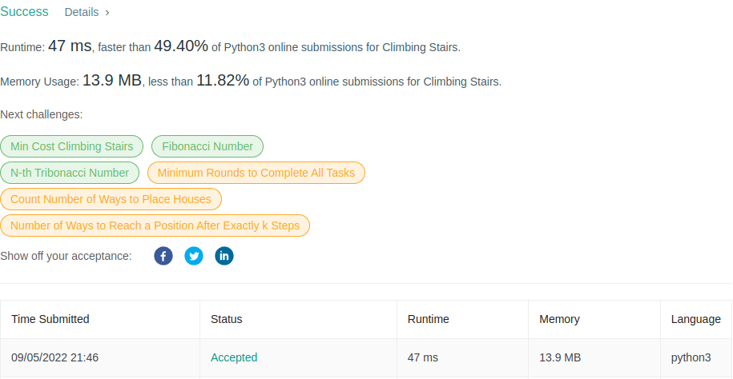
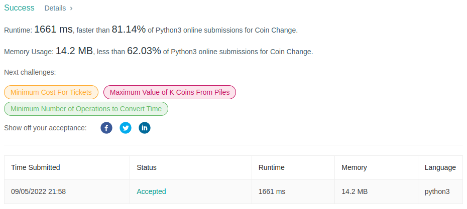

# PD_Solved-Exercises

**Conteúdo da Disciplina**: Prog Dinamica<br>

## Alunos
|Matrícula | Aluno |
| -- | -- |
| 17/0101711  |  Daniel Barcelos Moreira |

## Sobre 
O objetivo do projeto é solucionar alguns problemas de juízes online fazendo o uso de prog dinamica.

## Screenshots
### Problema da Escada
[Link para o problema](https://leetcode.com/problems/climbing-stairs/)


</figcaption>
    Imagem 1: Accepted Climbing Stairs
</figcaption>

### Problema Coin Change

[Link para o problema](https://leetcode.com/problems/coin-change/)


</figcaption>
    Imagem 2: Accepted Coin Change
</figcaption>

## Instalação 
**Linguagem**: Python<br>

## Uso 
- Instale o [python 3](https://www.python.org/downloads/);

```
python3 stairs.py
python3 coin.py
```


